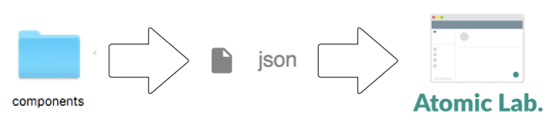

<h1 class="uc-section-title">How it works</h1>

You neeed Node.js environment to use this styleguide. because this styleguide generator load json files converted from template files (ejs/jade/haml/html).
It is almost impossible to make json by manual. So You may want to use CLI or gulp to make json file. Below is the breief image how atomic-lab works.

  

### components.json
For reference, below is the json structure that atomic-lab needs.

<pre>
<code class="json">{
  "components":[
    {
      "category":"atom/molecule/organism/template",
      "name":"name of the component",
      "html": "some HTML",
      "css": "path to the css file"
    }
    ...
  ]
}</code></pre>
